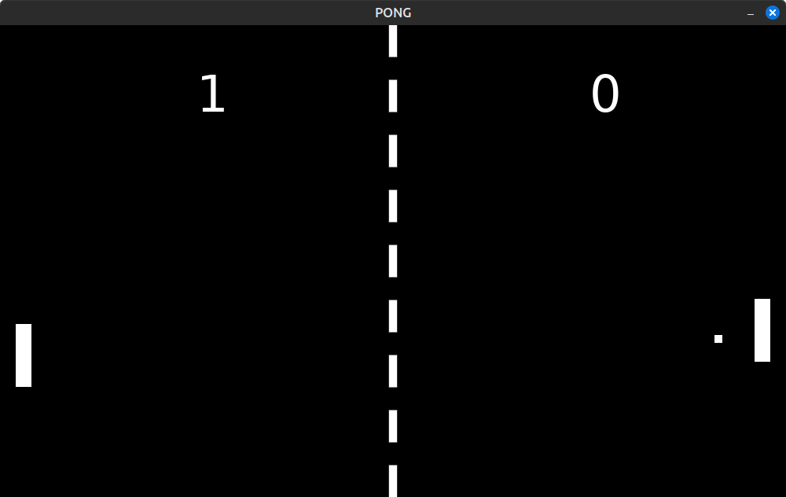

# Pong.lua

My attempt at recreating PONG using [LOVE2D](https://love2d.org/) and [Lua](https://www.lua.org/)

## Setup

- Make sure you have [LOVE2D](https://love2d.org/) downloaded and added to your PATH
- Once you're inside the project folder, run `love src/`
